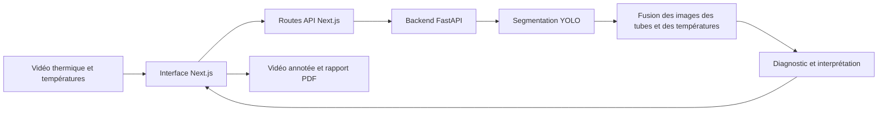

<p align="center">
  
</p>

# CSP Thermal Intelligence

**Inspection vidéo et diagnostic thermique des tubes absorbeurs CSP.**

CSP Thermal Intelligence est une application web qui accompagne l’inspection des tubes absorbeurs de centrales solaires à concentration (*Concentrated Solar Power*). Elle combine la détection des tubes dans une vidéo thermique et les températures saisies par l’opérateur pour estimer l’état du vide du tube test.

[Installation](#installation-sous-windows) · [Démarrage](#démarrage-de-lapplication) · [Utilisation](#utilisation) · [Fonctionnement](#fonctionnement-de-lanalyse) · [Dépannage](#dépannage)

## Informations du stage

| Information | Détail |
|---|---|
| Stagiaire | **[Salma Kamal](https://github.com/SALMAKAMAL21)** |
| Structure d’accueil | **Green Energy Park** |
| Encadrant | **Amine Moulay Taj** |
| Période du stage | **Du 09/03/2026 au 09/09/2026** |
| Projet | **CSP Thermal Intelligence** |
| Sujet | Détection d’anomalies sur les tubes absorbeurs CSP par analyse vidéo et fusion de données thermiques |

## Fonctionnalités

- Identification de l’opérateur et du numéro de série du tube.
- Import d’une vidéo thermique et aperçu dans un cadre 16:9.
- Saisie d’au moins quatre températures par tube, avec possibilité d’ajouter des mesures.
- Observation visuelle de l’opérateur : présence ou absence d’anomalie.
- Lancement de l’analyse uniquement lorsque les données nécessaires sont renseignées.
- Détection des tubes `tube_ref` et `tube_test`, puis affichage de leurs annotations sur la vidéo.
- Diagnostic combinant les informations visuelles et thermiques, avec une interprétation adaptée au résultat.
- Téléchargement de la vidéo annotée au format WebM et du rapport `rapport_thermique_csp.pdf`.
- Interface en français, adaptée aux écrans de différentes tailles, avec modes jour et nuit.

## Utilisation

1. Renseigner le **nom de l’opérateur** et le **numéro de série du tube**.
2. Importer la vidéo à inspecter : elle apparaît dans la partie droite de l’interface.
3. Saisir les températures du tube de référence et du tube test. Chaque point ajouté doit être rempli pour les deux tubes.
4. Indiquer si une anomalie est visible sur la vidéo.
5. Cliquer sur **Lancer l’analyse**, puis consulter la vidéo annotée, le diagnostic et son interprétation.
6. Cliquer sur **Générer PDF**, puis sur **Télécharger le rapport**.

La date et l’heure sont facultatives : si elles sont laissées vides, elles sont renseignées automatiquement au lancement de l’analyse. L’observation visuelle de l’opérateur ne modifie pas la prédiction du modèle.

### Présentation du diagnostic

| Couleur | État affiché | Signification |
|---|---|---|
| Vert | ÉTAT NORMAL | Aucune anomalie détectée |
| Jaune | ANOMALIE DÉTECTÉE | Dégradation légère du vide |
| Orange clair | ANOMALIE DÉTECTÉE | Dégradation modérée du vide |
| Orange foncé | ANOMALIE DÉTECTÉE | Dégradation importante du vide |
| Rouge | ANOMALIE DÉTECTÉE | Perte complète du vide |

Le diagnostic s’accompagne de constats et d’une interprétation. Si aucune paire de tubes exploitable n’est détectée, la classification est signalée comme indisponible.

### Rapport PDF

Le rapport contient les informations d’inspection, le diagnostic, l’interprétation, un emplacement pour la validation du technicien et un tableau des températures.

- L’image est extraite **au milieu de la vidéo importée**, avec les annotations correspondant à cet instant.
- La capture est affichée entière, avec ses proportions conservées, pour éviter de couper les tubes.
- Les écarts du tableau sont calculés avec la formule **`|T_ref - T_test|`**. Leur moyenne est affichée ; aucune colonne d’écart-type n’est ajoutée.
- La mise en page prévoit une page pour les rapports usuels de quatre à six mesures. Les séries plus longues peuvent continuer sur d’autres pages.
- Le fichier téléchargé porte le nom **`rapport_thermique_csp.pdf`**.

## Architecture



| Composant | Technologies |
|---|---|
| Interface | Next.js 14, React 18, TypeScript, CSS |
| API d’inférence | FastAPI, Uvicorn, Python |
| Segmentation | Ultralytics YOLO, checkpoint `opt_best.pt` |
| Classification | PyTorch, modèle de fusion à sorties ordinales |
| Traitement des images | OpenCV, Pillow, NumPy, torchvision |
| Vidéo dans le navigateur | Canvas, `MediaRecorder` |
| Rapport PDF | jsPDF |

## Installation sous Windows

Les commandes suivantes s’exécutent dans **PowerShell**. L’environnement utilisé pour cette version comprend **Python 3.12**, **Node.js 24**, npm et Git.

### 1. Récupérer le projet

```powershell
git clone https://github.com/SALMAKAMAL21/CSP_Thermal_Intelligence.git
cd CSP_Thermal_Intelligence
```

Si vous disposez déjà du projet, placez-vous directement dans son dossier racine, celui qui contient `requirements.txt`, `src` et `frontend`.

### 2. Installer les dépendances Python

```powershell
py -3.12 -m venv venv
.\venv\Scripts\python.exe -m pip install --upgrade pip
.\venv\Scripts\python.exe -m pip install -r requirements.txt
```

Les commandes utilisent directement le Python de l’environnement virtuel ; son activation dans PowerShell n’est pas nécessaire.

### 3. Vérifier les modèles

Ces fichiers sont nécessaires à l’analyse :

```text
src/models/opt_best.pt
src/models/best_fusion_model.pt
configs/fusion.json
```

`fusion.json` contient les paramètres de normalisation et l’empreinte du checkpoint de fusion. Le modèle et sa configuration doivent correspondre.

### 4. Installer le frontend

```powershell
cd frontend
npm.cmd ci
if (-not (Test-Path .env.local)) {
    Copy-Item .env.example .env.local
}
cd ..
```

Le fichier `frontend/.env.local` configure l’adresse du backend :

```env
SEGMENTATION_API_URL=http://127.0.0.1:8002
```

## Démarrage de l’application

Ouvrir **deux terminaux** et laisser les deux services actifs.

### Terminal 1 : backend IA

Depuis la racine du projet :

```powershell
.\venv\Scripts\python.exe -m uvicorn src.inference.api:app --host 127.0.0.1 --port 8002
```

- Vérification du backend : [http://127.0.0.1:8002/health](http://127.0.0.1:8002/health).
- Documentation interactive de l’API : [http://127.0.0.1:8002/docs](http://127.0.0.1:8002/docs).
- Modèles chargés : [http://127.0.0.1:8002/model/info](http://127.0.0.1:8002/model/info).

Pour une analyse complète, la réponse de `/health` doit indiquer `model_loaded: true` et `fusion_loaded: true`. Le backend choisit CUDA, MPS ou le CPU selon leur disponibilité.

### Terminal 2 : interface web

Depuis la racine du projet :

```powershell
cd frontend
npm.cmd run dev
```

Ouvrir **[http://localhost:3000](http://localhost:3000)** dans le navigateur.

### Compilation de production

Depuis `frontend`, après avoir arrêté le serveur de développement :

```powershell
npm.cmd run build
npm.cmd run start
```

Le backend IA doit rester démarré. Les fichiers de développement sont générés dans `.next-dev` et ceux de production dans `.next`.

## Fonctionnement de l’analyse

1. Le navigateur extrait une image par seconde de la vidéo.
2. Le modèle YOLO détecte les tubes. Les classes `tube_ref` et `tube_test` renvoyées par le modèle sont conservées.
3. Pour chaque image exploitable, les zones des deux tubes sont redimensionnées en `224 × 224` pixels et normalisées avant la classification.
4. Le modèle de fusion combine ces zones avec l’écart signé entre les températures moyennes : `moyenne(T_ref) - moyenne(T_test)`.
5. Les probabilités cumulatives des images valides sont moyennées pour obtenir le diagnostic de la vidéo.
6. Le navigateur produit la vidéo annotée et prépare la capture du milieu de la vidéo pour le rapport.

Les écarts absolus du **tableau PDF** sont destinés à la lecture des mesures. Le **modèle** reçoit l’écart signé conforme à sa configuration d’entraînement.

Lorsqu’on modifie les températures d’une même vidéo, les détections déjà calculées peuvent être réutilisées pour relancer la classification. Le changement d’une donnée d’inspection invalide le résultat affiché et demande une nouvelle analyse avant l’export du rapport.

## Configuration

| Variable | Service | Valeur par défaut |
|---|---|---|
| `SEGMENTATION_API_URL` | Next.js | `http://127.0.0.1:8002` |
| `MODEL_PATH` | FastAPI | `src/models/opt_best.pt` |
| `FUSION_MODEL_PATH` | FastAPI | `src/models/best_fusion_model.pt` |
| `FUSION_CONFIG_PATH` | FastAPI | `configs/fusion.json` |

Les chemins des modèles sont résolus depuis la racine du projet par défaut. Pour les remplacer, définir les variables dans le terminal du backend avant son démarrage. `frontend/.env.local` configure le service Next.js.

## Organisation du dépôt

```text
CSP_Thermal_Intelligence/
├── configs/
│   └── fusion.json                  # Normalisation et empreinte du modèle de fusion
├── frontend/
│   ├── app/                         # Page d’inspection, styles et routes API
│   ├── components/                  # Composants de l’interface
│   ├── hooks/use-csp-analysis.ts     # Traitement vidéo et orchestration de l’analyse
│   ├── lib/                         # Diagnostic, calculs thermiques et export PDF
│   ├── logo/                        # Identité visuelle Green Energy Park
│   ├── .env.example                 # Exemple de configuration du backend
│   └── package.json                 # Dépendances et commandes du frontend
├── src/
│   ├── inference/
│   │   ├── api.py                   # API FastAPI
│   │   ├── fusion_anomaly.py        # Prétraitement et prédiction
│   │   └── fusion_model.py          # Architecture du modèle de fusion
│   └── models/                      # Poids de segmentation et de classification
├── scripts/                         # Outils de préparation des données
├── tests/test_fusion_inference.py   # Vérifications du pipeline de fusion
├── requirements.txt                 # Dépendances Python
└── README.md
```

La [documentation du frontend](frontend/README.md) précise le rôle des fichiers et des routes de l’interface.

## Vérifications

Depuis la racine du projet, avec le checkpoint de fusion présent :

```powershell
.\venv\Scripts\python.exe -m unittest discover -s tests -p "test_fusion_inference.py"
```

Depuis `frontend`, vérifier la compilation de l’interface :

```powershell
npm.cmd run build
```

## Dépannage

| Situation | Vérification |
|---|---|
| Backend IA indisponible | Lancer FastAPI avec `venv\Scripts\python.exe`, puis ouvrir `/health`. |
| Erreur `No module named uvicorn` | Installer les dépendances avec le Python du même environnement virtuel que celui utilisé pour démarrer le backend. |
| Réponse HTML au lieu de JSON | Vérifier que `SEGMENTATION_API_URL` pointe vers FastAPI sur le port `8002`, puis redémarrer Next.js après modification de `.env.local`. |
| Modèle de fusion indisponible | Vérifier la présence de `best_fusion_model.pt` et sa correspondance avec `configs/fusion.json`. |
| Bouton d’analyse désactivé | Compléter le nom, le numéro de série, la vidéo, toutes les températures et l’observation visuelle. |
| Aucune paire de tubes exploitable | Vérifier que les deux tubes sont visibles et détectés sur la vidéo. |
| PowerShell bloque `npm.ps1` | Utiliser les commandes `npm.cmd` indiquées dans ce guide. |

© Copyright Green Energy Park. Tous droits réservés 2026.
